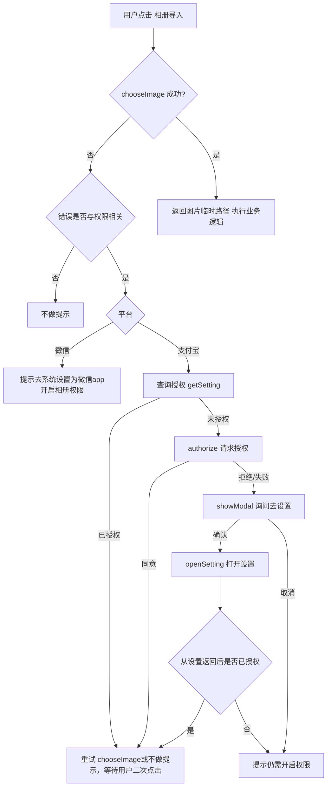

标签： #Uniapp #权限 #相册 #微信小程序 #支付宝小程序 #跨端兼容 

## 结论与要点
- **拒绝授权处理**：用户曾拒绝，后续不会再弹系统授权，只能引导到设置页开启
- **小程序设置页**：小程序设置页和系统设置不同，是微信或支付宝app内部对单个小程序的权限管理页面
- **推荐通用策略**：调用api失败 → 查询授权 → 请求授权 → 引导设置页 → 失败兜底提示

## 流程图
以获取访问相册权限为例


## 示例
```vue
<template>
  <view class="page">
    <button class="btn" @click="chooseFromAlbum">相册导入</button>
  </view>
</template>

<script setup>
import { ref } from 'vue'

function chooseFromAlbum () {
  uni.chooseImage({
    count: 1,
    sizeType: ['compressed'],
    sourceType: ['album'],
    success: (res) => {
      // TODO: 这里继续上传/业务处理
      const filePath = (res.tempFilePaths && res.tempFilePaths[0]) || ''
    },
    fail: async (e) => {
      const msg = e?.errMsg || ''
      // 常见关键词："授权"、"permission"
      // 安卓微信真机：拒绝授权时为{errMsg: 'chooseImage:fail:system permission denied'}
      // ios支付宝真机：拒绝授权时为{errMsg: 'chooseImage:fail 用户不允许授权'}
      const maybePermission = /授权|permission/i.test(msg)
      if (!maybePermission) {
        return uni.showToast({ title: '选择失败，请重试', icon: 'none' })
      }

      // #ifdef MP-WEIXIN
      // 微信不需要相册读取授权，此处多为系统层级限制，给出引导即可
      uni.showToast({ title: '请在系统设置中开启相册权限后重试', icon: 'none' })
      // #endif

      // #ifdef MP-ALIPAY
      await ensureAlbum()
      // 可选：授权后自动重试
      // chooseFromAlbum()
      // #endif
    }
  })
}

function getRScope(scope){
  // 仅示例所需的最小映射
  if(scope === 'album'){
    // #ifdef MP-ALIPAY
    return 'album'
    // #endif
    // #ifdef MP-WEIXIN
    return '' // 微信无需相册读取授权
    // #endif
  }
  return ''
}


function getSetting(scope){
  let rScope = getRScope(scope)
  if(!rScope)return Promise.reject('code is not valid')

  return new Promise((resolve, reject) => {
    uni.getSetting({
      success: (res) => {
        console.log('getSetting success', res);
        resolve(!!res.authSetting[rScope])
      },
      fail: (err) => reject({
        err,
        msg: 'uni.getSetting fail',
      })
    })
  })
}

function authorize(scope){
  let rScope = getRScope(scope)
  if(!rScope)return Promise.reject('scope is not valid')

  // 提前向用户发起授权请求。调用后会立刻弹窗询问用户是否同意授权小程序使用某项功能或获取用户的某些数据，但不会实际调用对应接口
  // 首次authorize会拉起询问弹窗，若用户拒绝，后续调用会直接执行失败回调；若用户同意，后续调用直接执行成功回调
  // 不清楚该接口本身调用失败是否会执行失败回调？
  // uniapp文档显示支付宝小程序不支持uni.authorize，真机上发现会自动执行失败回调
  return new Promise((resolve, reject) => {
    uni.authorize({
      scope: rScope,
      success: (res) => {
        console.log('uni.authorize success', res);
        resolve(true)
      },
      fail: (err) => {
        console.log('uni.authorize fail', err);
        resolve(false)
      },
    })
  })
}


function openSetting(scope){
  let rScope = getRScope(scope)
  if(!rScope)return Promise.reject('scope is not valid')

  return new Promise((resolve, reject) => {
    uni.openSetting({
      success: (res) => {
        console.log('uni.openSetting success', res);
        const { authSetting } = res
        resolve(!!authSetting[rScope])
      },
      fail: (err) => reject({
        err,
        msg: 'uni.openSetting fail',
      })
    })
  })
}


async function ensureAlbum(){
  try {
    // 1.查询是否授权
    const granted = await getSetting('album')
    if (granted) return
    // 2.尝试获取授权
    const ok = await authorize('album')
    if (ok) return
    // 3.引导去设置页获取授权
    const confirm = await new Promise((resolve) => {
      uni.showModal({
        title: '权限请求',
        content: '需要相册权限以导入图片，是否前往设置？',
        confirmText: '去设置',
        success: (r) => resolve(!!r.confirm),
        fail: () => resolve(false)
      })
    })
    if(!confirm) return
    // 4.从设置页返回后是否获得授权
    const newGranted = await openSetting('album')
    if(!newGranted){
      uni.showToast({ title: '请开启相册权限后再试', icon: 'none' })
    }
  } catch (err) {
    uni.showToast({ title: '需要相册权限以导入图片', icon: 'none' })
  }
}
</script>
```

## 常见问题
- **概念区分**：`scope.writePhotosAlbum` 是“保存到相册”权限；与访问相册选择图片无直接关联。
- **支付宝 authorize 不稳定/不支持**：在部分版本会直接进入失败回调，应在失败分支走 openSetting 引导逻辑。
- **错误文案差异**：iOS/Android、微信/支付宝的 `errMsg` 文案不同，建议使用关键词包含判断（如“授权”“permission”）。
- **重试策略**：完成授权后可选择自动重试 `chooseImage`，注意加防抖，避免连续弹窗或多次触发。

## 参考
- UniApp 文档：`chooseImage`、`getSetting`、`openSetting`、`authorize`
- 微信小程序文档：相册/相机能力与 `scope.writePhotosAlbum`
- 支付宝小程序文档：权限与设置页
