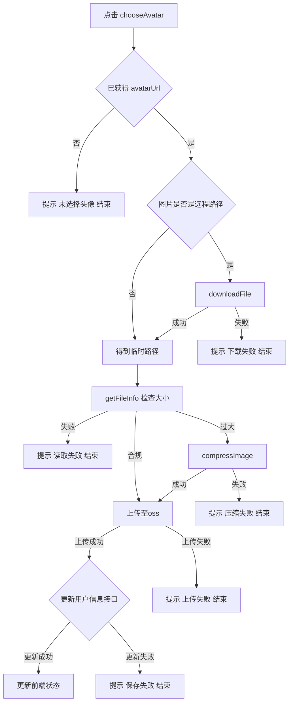
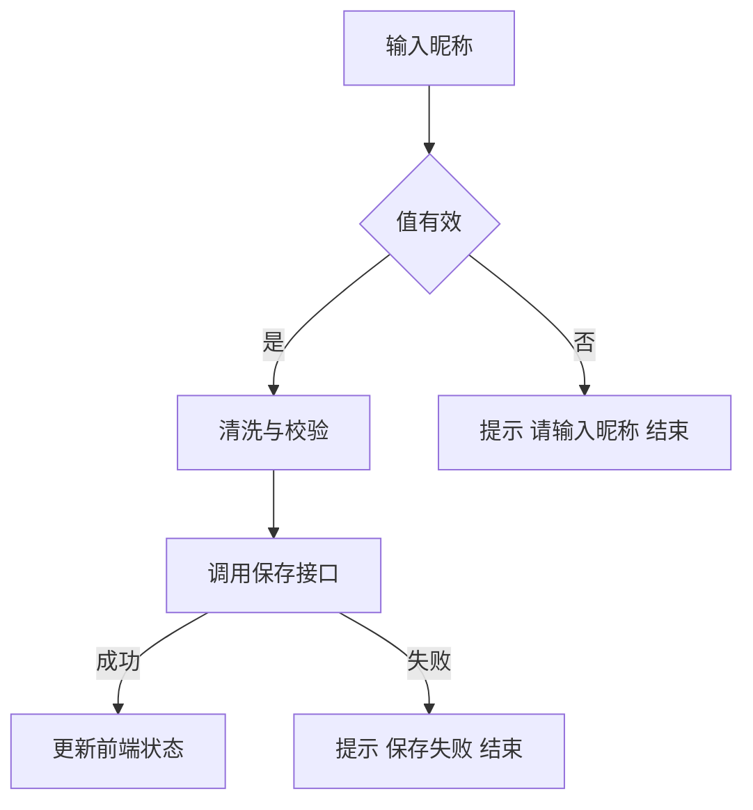

标签： #Uniapp #微信小程序 #支付宝小程序 #头像 #昵称 #开放能力 #跨端兼容 

## 结论与要点
- **平台与兼容性**： 支付宝小程序 微信小程序
- **统一做法**：使用 `button open-type="chooseAvatar"` 获取头像文件，配合 `input type="nickname"` 获取/引导填写昵称；均需用户主动操作。
- **旧 API 已不可用**：`wx.getUserInfo`、`wx.getUserProfile`、`my.getOpenUserInfo` 将返回默认昵称与灰色头像，不应用于真实用户信息。
- **跨端注意**：在 `uni-app` 中用条件编译区分平台；部分平台（如 Alipay）返回的头像可能为远程 URL，需先 `downloadFile` 转临时路径再上传。
- **图片处理**：控制头像体积（建议 ≤ 1MB，超出可用 `uni.compressImage`），再用 `uni.uploadFile` 上传至后端，落库更新用户资料。
- **兼容与限制**：开放能力依赖较新的客户端/基础库版本；H5/APP 端不生效，需降级为普通文件选择或引导用户手动填写。

## 流程图

#### 步骤
1. 在页面展示用于触发头像选择的按钮：`button open-type="chooseAvatar"`，绑定 `@chooseavatar` 事件。
2. 从 `e.detail.avatarUrl` 取到临时路径或远程 URL（视平台而定）。
3. 如为支付宝且返回远程 URL，先 `my.downloadFile` 转本地临时路径。
4. 调用 `uni.getFileInfo` 判断体积是否合规；超限时用 `uni.compressImage` 压缩。
5. 用 `uni.uploadFile` 上传至后端，后端落库并返回 CDN 地址；前端更新 `userProfile.headImg`。
6. 昵称通过输入框获取与校验，提交后端保存，并更新本地 `userProfile.nickname`。

#### 头像获取


#### 昵称获取



## 示例：获取头像
**模板**
```html
  <button 
    class="user-profile-wrapper" 
    open-type="chooseAvatar" 
    @chooseavatar="onChooseAvatar"
  >
    <ImgWrapper 
      :src="userProfile.headImg" 
      width="64rpx" 
      height="64rpx" 
      class="avatar-wrapper" 
      mode="aspectFill"
    />
    <text class="text-size-normal">
      {{ userProfile.nickname }}
    </text>
  </button>
```
**样式**
```scss
.user-profile-wrapper {
  // 重置按钮样式
  height: unset !important;
  line-height: unset !important;
  background: transparent !important;
  border: none !important;
  padding: 0 0 0 24rpx !important;
  &::after {
    border: none !important;
  }
  display: flex;
  align-items: center;
  gap: 16rpx;
  color: #494E52;
  .avatar-wrapper {
    border-radius: 50%;
    overflow: hidden;
    box-shadow: 0rpx 4rpx 16rpx 0rpx rgba(5, 5, 5, 0.09);
    outline: 2rpx solid #FFFFFF;
  }
}
```

**处理逻辑**
```js
//#region 更新头像
const userProfile = ref({
  nickname: '',
  headImg: '',
})
async function onChooseAvatar(e) {
  if(!e.detail.avatarUrl) return
  let avatarTempUrl = e.detail.avatarUrl
  uni.showLoading()
  try {
    // #ifdef MP-ALIPAY
    // 支付宝头像图片返回的url是一个远程服务器上的地址
    if(!avatarTempUrl.includes('resource')){
      avatarTempUrl = await downloadAvatar(avatarTempUrl)
    }
    // #endif
    
    const isOk = await checkAvatarSize(avatarTempUrl)
    if(!isOk){
      avatarTempUrl = await compressAvatar(avatarTempUrl)
    }
    
    const newHeadImg = await uploadAvatar(avatarTempUrl)
    onSave(newHeadImg)
  } catch (error) {
    console.log('choose avatar fail', error);
  } finally {
    uni.hideLoading()
  }
}

function checkAvatarSize(avatarTempUrl){
  console.log('检查大小');
  return new Promise((resolve, reject) => {
    uni.getFileInfo({
      filePath: avatarTempUrl,
      success: (res) => {
        console.log('检查大小成功', res);
        resolve(res.size > 1024 * 1024 * 1 ? false : true)
      },
      fail: (err) => {
        reject({
          msg: 'uni getFileInfo fail',
          err
        })
      }
    })
  })
}

function compressAvatar(avatarTempUrl){
  console.log('压缩');
  return new Promise((resolve, reject) => {
    uni.compressImage({
      src: avatarTempUrl,
      success: (res) => {
        console.log('压缩成功', res);
        resolve(res.tempFilePath)
      },
      fail: (err) => {
        console.log('压缩失败', err);
        reject({
          msg: 'uni compressImage fail',
          err
        })
      }
    })
  })
}

function downloadAvatar(tempFilePath){
  console.log('支付宝下载', tempFilePath);
  return new Promise((resolve, reject) => {
    my.downloadFile({
      url: tempFilePath,
      success: (res) => {
        resolve(res.tempFilePath)
      },
      fail: (err) => {
        console.log('my download avatar fail', err);
        reject({
          msg: 'my download avatar fail'
          err
        })
      },
    })
  })
}

function uploadAvatar(tempFilePath) {
  console.log('上传');
  return new Promise((resolve, reject) => {
    uni.uploadFile({
      url: `${configURL.BaseURL}/mpImgController/doUpLoadOss`,
      filePath: tempFilePath,
      name: 'file',
      fileType: 'image',
      formData: {
        fileType: '7',
      },
      success: (res) => {
        if (res.data) {
          const data = JSON.parse(res.data)
          if (data.success) {
            resolve(configURL.OssUrl + data.result)
          } else {
            modal.toast(data.message)
            reject(data.message)
          }
        } else {
          modal.toast('上传接口调用失败')
          reject('上传接口调用失败')
        }
      },
      fail: (err) => {
        console.log('uni uploadFile fail', err);
        reject('上传接口调用失败')
      }
    });
  })
}

const onSave = (headImg) => {
  // ...上传信息至后端，更新用户信息
}
//#endregion

```


获取昵称过程类似，不赘述


## 获取昵称（最小示例，含条件编译）
```html
<!-- 微信小程序推荐：启用昵称开放能力 -->
<!-- #ifdef MP-WEIXIN -->
<input type="nickname" placeholder="请输入昵称" @input="onNicknameInput" />
<!-- #endif -->

<!-- 其他端降级为普通文本输入 -->
<!-- #ifndef MP-WEIXIN -->
<input type="text" placeholder="请输入昵称" @input="onNicknameInput" />
<!-- #endif -->
```

```js
const userProfile = ref({
  nickname: '',
  headImg: ''
})

function onNicknameInput(e) {
  const value = (e?.detail?.value || '').trim()
  userProfile.value.nickname = sanitizeNickname(value)
}

function sanitizeNickname(str) {
  // 业务可按需：长度上限、去除前后空格、过滤特殊字符等
  return str.slice(0, 20)
}

async function saveNickname() {
  if (!userProfile.value.nickname) {
    return modal.toast('请输入昵称')
  }
  uni.showLoading()
  try {
    // TODO: 调用后端保存昵称接口
    // await api.updateNickname({ nickname: userProfile.value.nickname })
    modal.toast('已保存')
  } catch (err) {
    console.log('save nickname fail', err)
    modal.toast('保存失败')
  } finally {
    uni.hideLoading()
  }
}
```

## 常见问题/坑
- **必须用户手势触发**：`chooseAvatar` 需由用户点击触发，不能在无手势场景直接弹出。
- **临时路径与远程 URL**：微信多为临时文件路径；支付宝可能为远程 URL，务必先 `downloadFile` 再上传，同时也需要一个判断是否为远程地址的逻辑。
- **上传入参差异**：`uni.uploadFile` 在部分平台需携带 `fileType: 'image'`（如支付宝），注意条件编译。
- **体积与格式**：大图请压缩；`compressImage` 可能改变格式与透明通道，必要时压缩后再检查效果。

## 参考
- [支付宝小程序开放能力（头像昵称）](https://opendocs.alipay.com/mini/0cz1w1)
- [微信开放能力说明（用户信息变更）](https://developers.weixin.qq.com/community/develop/doc/00022c683e8a80b29bed2142b56c01)
- [微信 User Profile 能力说明](https://developers.weixin.qq.com/miniprogram/dev/framework/open-ability/userProfile.html)