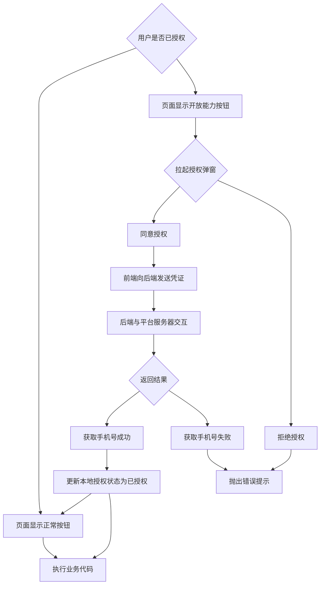

# Uniapp中请求手机号授权


## 概述

不同平台的手机号授权方式略有差异：
- **微信小程序**：使用 `open-type="getPhoneNumber"` 获取加密手机号信息
- **支付宝小程序**：使用 `open-type="getAuthorize"` 和 `scope="phoneNumber"` 获取授权

## 授权流程图



## 注意事项

1. **授权状态管理**：在数据库和本地存储记录授权状态，避免重复授权
2. **防抖处理**：对授权按钮进行防抖处理，防止重复点击
3. **错误处理**：需要处理用户拒绝授权的情况
4. **平台差异**：微信和支付宝的授权流程和数据格式不同，需要分别处理
5. **前后端联调**：前端无法独立完成授权流程，需要后端配合 

## 微信小程序授权

### 特点
- 使用 `open-type="getPhoneNumber"` 属性
- 监听 `@getphonenumber` 事件
- 获取到的是加密数据，需要后端解密

### 关键步骤
1. 用户点击按钮触发授权
2. 检查 `e.detail.errMsg` 是否为 `'getPhoneNumber:ok'`
3. 将 `encryptedData`、`iv` 和 `openId` 发送给后端
4. 后端解密获取真实手机号

### 数据结构
```js
// 微信返回的事件对象结构
{
  detail: {
    errMsg: "getPhoneNumber:ok",
    encryptedData: "加密数据",
    iv: "初始向量"
  }
}
```

### 模板实现
```html
<view v-if="isAuth" class="button" @click="confirmDebounce">预约上门</view>
<button v-else open-type="getPhoneNumber" @getphonenumber="onAuthDebounce">预约上门</button>
```

### 初始化代码
```js
onShow(() => {
  const authStatus = uni.getStorageSync('authStatus')
  isAuth.value = authStatus == 2
})

const isAuth = ref(false)
const onAuthDebounce = debounce(onAuth, 300)
```

### 授权处理代码
```js
const onAuth = (e) => {
  if(e.detail.errMsg === 'getPhoneNumber:ok'){
    // 用户同意获取手机号，接收到获取凭证，传给后端解密获取手机号
    userLoginAPI.wxUserAuth({
      encryptedData: e.detail.encryptedData,
      iv: e.detail.iv,
      openId: uni.getStorageSync('wxopenid') // openId需要使用其它接口（静默登录接口）获得
    }).then((res) => {
      if(res.success){
        // 根据后端返回的结果判断授权是否成功，成功则更新当前应用中用户的授权状态
        isAuth.value = true
        uni.setStorageSync('authStatus', 2)
        // ...其它业务代码
      }
    })
  }else{
    modal.toast('请同意授权')
  }
}
```

## 支付宝小程序授权

### 特点
- 使用开放能力，button上添加 `open-type="getAuthorize"` 和 `scope="phoneNumber"`属性
- 监听 `@getAuthorize` 事件
- 需要调用 `my.getPhoneNumber()` API

### 关键步骤
1. 用户点击按钮触发授权
2. 在授权成功回调中调用 `my.getPhoneNumber()`
3. 将获取的 `response` 发送给后端
4. 后端通过支付宝接口获取真实手机号

### 模板实现
```html
<button v-if="isAuth" @click="confirmDebounce">预约上门</button>
<button v-else open-type="getAuthorize" scope="phoneNumber" @getAuthorize="onAuthDebounce">预约上门</button>
```

### 初始化代码
```js
onShow(() => {
  const authStatus = uni.getStorageSync('authStatus')
  isAuth.value = authStatus == 2
})

const isAuth = ref(false)
const onAuthDebounce = debounce(onAuth, 300)
```

### 授权处理代码
```js
const onAuth = (e) => {
  my.getPhoneNumber({
    success: (res) => {
      // 用户同意获取手机号，接收到获取凭证，传给后端向支付宝服务器发起请求获取手机号
      const code = res.response
      userLoginAPI.userAuth({
        code: code,
      }).then((res) => {
        if(res.success){
          // 根据后端返回的结果判断授权是否成功，成功则更新当前应用中用户的授权状态
          isAuth.value = true
          uni.setStorageSync('authStatus', 2)
          // ...其它业务逻辑
        }
      })
    },
    fail: (err) => console.log(err)
  })
}
```
