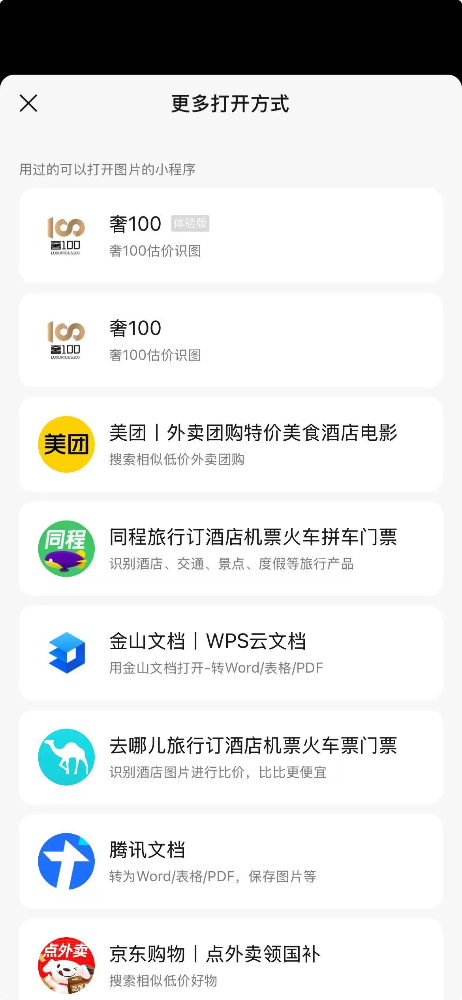

# 微信聊天素材唤起小程序

> 官方文档：https://developers.weixin.qq.com/miniprogram/dev/framework/material/support_material.html
> https://developers.weixin.qq.com/miniprogram/dev/api/base/app/app-event/wx.onAppShow.html#%E5%8A%9F%E8%83%BD%E6%8F%8F%E8%BF%B0

## 概述

微信聊天素材唤起小程序是微信提供的一种开放能力，允许用户通过在聊天会话中分享的图片、视频等素材直接打开对应的小程序。这种能力可以大大提升用户体验，实现从聊天素材到小程序的无缝跳转。



## 实现流程

### 1. 配置
supportedMaterials的配置请参照官方文档。
注意配置完成后运行到微信小程序开发者工具，在调试器里会提示`invalid app.json ["supportedMaterials"]`，但实际上是生效的。

```json
// 在manefest.json中配置supportedMaterials
/* 小程序特有相关 */
"mp-weixin" : {
    "appid" : "xxxxxxxxxxx",
    "supportedMaterials" : [
        {
            "materialType" : "image/*",
            "name" : "用${nickname}打开",
            "desc" : "奢100估价识图",
            "path" : "packageA/pages/estimateBegin/estimateBegin?from=external"
        }
    ],
},
```
### 2. 接收参数
当用户通过聊天素材进入小程序时，需要正确处理场景值：

```javascript
// 在App.vue中处理启动参数
// onLaunch和onShow都可以接收到相关参数
import { onLaunch, onShow, onHide, onError, onPageNotFound } from "@dcloudio/uni-app";
onShow((option) => {
  // #ifdef MP-WEIXIN
  // 微信聊天素材调起窗口
  const { scene, forwardMaterials } = option
  if(scene === 1173 && forwardMaterials.length){
    const tempFile = forwardMaterials[0]
    uni.setStorageSync('AiImage', tempFile)
    // ...业务代码
  }
  // #endif
});
```

### 3. 测试
测试此功能需要上传到线上体验版，使用过后几分钟内就可以在聊天素材处看到体验版的小程序。
体验版的小程序和线上正式小程序是分开的，不会互相影响。